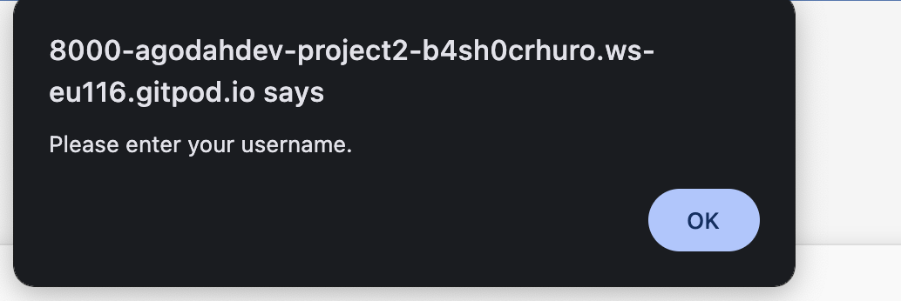
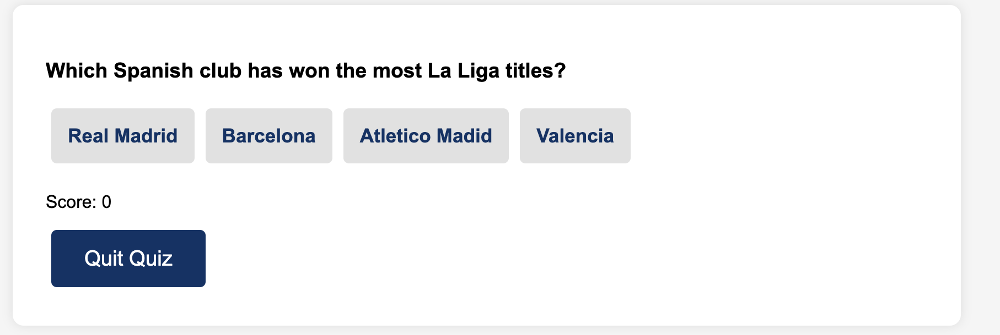
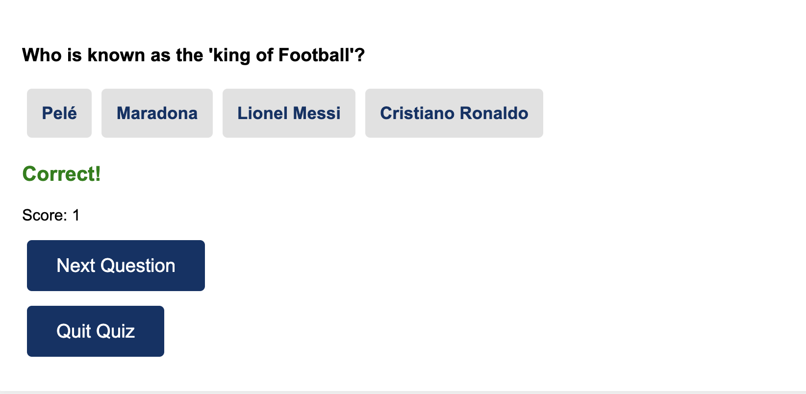
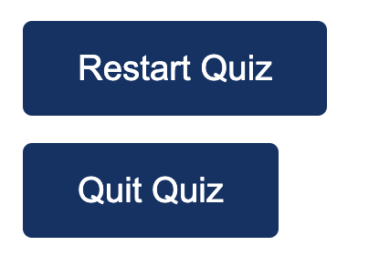
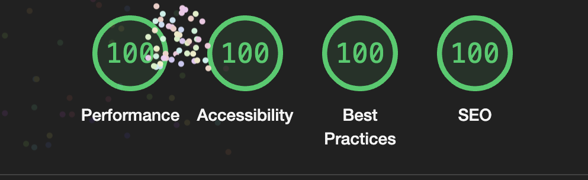

# Football Quiz Challenge

- This site is an online football quiz that allows users to test their knowledge on football knowledge.

## Features

- **Start Quiz**: Users must enter their username to start the quiz:

- **Questions Randomization**: Questions are shuffled each time the quiz is played/

- **Score Tracking**: The Quiz tracks and displays the user's score.

- **Next Question Button**: Allows users to progress through the quiz.

- **Restart and Quit options**: Users are able to restart the quiz or quit at any time.

## Programs:

- **HTML**: Provides the structure of the web page.
- **CSS**: Styles the web page for a better user experience.
- **JavaScript**: Manages the quiz inertactivily, score tracking, and score tracking and question handling.

## Validator Testing:

 - **HTML**:

   - No errors were found when passinf throught the offical W3C validator.

- **CSS**:

   - No erros were found when passing through the official Jisaw W3C CSS validator.

- **Javascript**:

- The javascript code has been tested using **JS Hint**. It has returned 26 warning but no errors.

- **Accessibility**:

  - The website uses good color contrast and includes alt text for image and accessible by running it through lighthouse inndev tools

  - **lighthouse performance**:
    **Performance**: 100
    **Accessbility**: 100
    **Best Practices**: 100
    **SEO**: 100

  

## Deployment:

- The site is deployed by Github pages. 

The live link can be found here: https://agodahdev.github.io/project2/

## Credit:

-**Fisher-Yestes shuffle algorithm**: This project uses the Fisher-Yates algorithm in shuffle quiz questions. This is that the questions are 
randomized each time the quiz is taken, offering a fresh experience for the user. (https://en.wikipedia.org/wiki/Fisher%E2%80%93Yates_shuffle).

