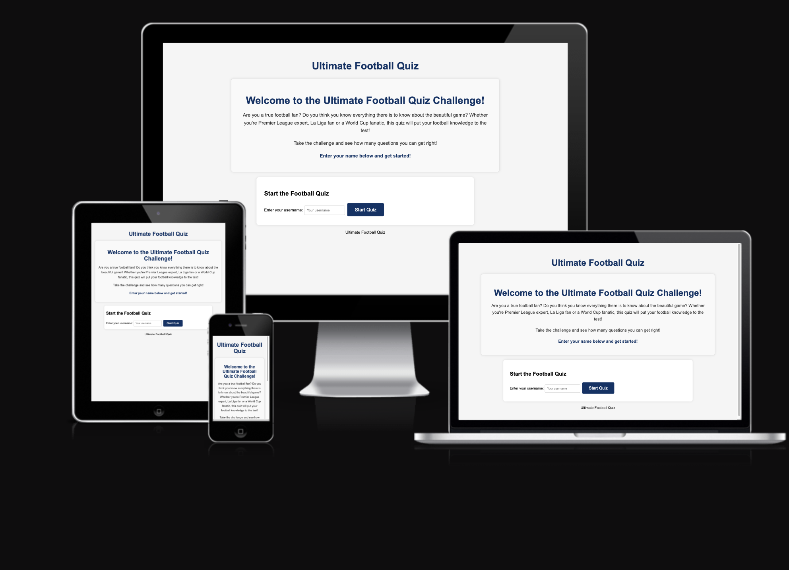
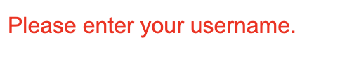
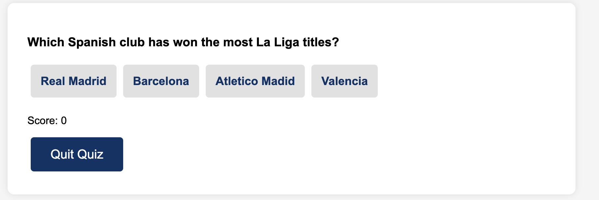
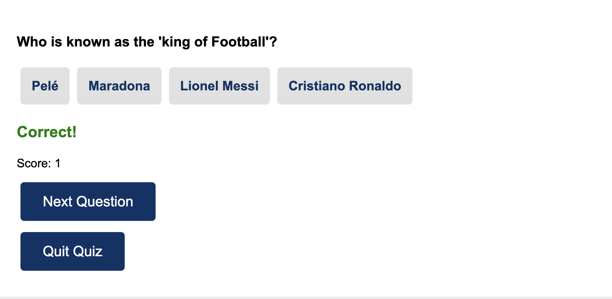
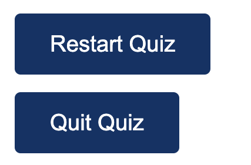
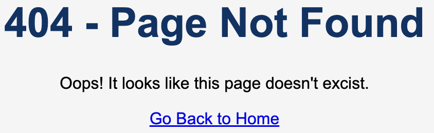
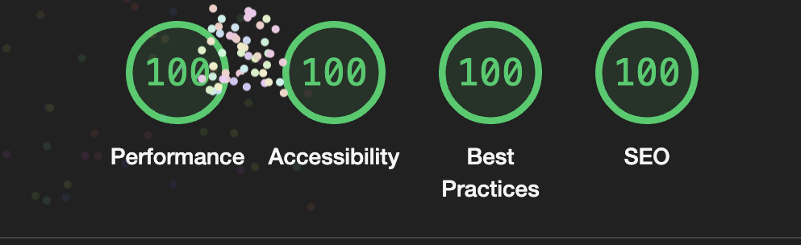

# Football Quiz Challenge

- This site is an online football quiz that allows users to test their football knowledge..

## Features

- **Start Quiz**: Users must enter their username to start the quiz:

- **Questions Randomization**: Questions are shuffled each time the quiz is played.

- **Score Tracking**: The Quiz tracks and displays the user's score.

- **Next Question Button**: Allows users to progress through the quiz.

- **Question Tracker**: This feature makes it easy for users to know how many questions are left, helping them stay engaged and informed as they complete the quiz.

- **Timer Feature**: The quiz has a 5-minute countdown timer. When the time runs out, the quiz ends automatically and displays your score.

- **Restart and Quit options**: Users are able to restart the quiz or quit at any time.

- **404 Page**: A custom 404 error page that guides users back to the home page if they navigate to a non-existent page.

## How to Use

1. Open the quiz webpage.
2. Enter your username and press Start Quiz.
3. The timer starts once the quiz begins. Answer each question by selecting an option.
4. Track your score and progress via the score display and question tracker.
5. If the timer reaches 0:00, the quiz ends automatically, and your score is displayed.
6. Quit and Restart Options:
   - Quit: Press the Quit button at any time to exit the quiz and return to the username input screen.
   - Restart: Press the Restart button to reset the quiz with a new question order and a fresh timer.

## Programs:

- **HTML**: Provides the structure of the web page.
- **CSS**: Styles the web page for a better user experience.
- **JavaScript**: Manages the quiz interactivity, score tracking, and question handling.

## Validator Testing:

 - **HTML**:

   - No errors were found when passing through the official W3C validator.

- **CSS**:

   - No errors were found when passing through the official Jigsaw W3C CSS validator."

- **Javascript**:

- The JavaScript code has been tested using JSHint. It returned 38 warnings but no errors.

- **Accessibility**:

  - The website uses good color contrast, includes alt text for images, and was tested for accessibility using Lighthouse in DevTools.

  - **lighthouse performance**:
    **Performance**: 100
    **Accessibility**: 100
    **Best Practices**: 100
    **SEO**: 100

  

## Testing:
- **Username Validation**:
  - If the user tries to start the quiz without entering a username, a red validation message appears, prompting them to enter their name. This was added to replace the old alert boxes to improve user experience.

- **Randomized Question Order**:
  - The questions appeared in the same order each time the quiz was restarted. After adding the Fisher-Yates algorithm, questions now appear in a different order with each attempt, enhancing the user's experience.

- **Answer Selection**:
  - Only answer can be selected per question. Correct answers display "Correct!" and incorrect answers display "Wrong!"

- **Question Tracker**:
  - Check the question tracker after each question. The tracker should update to show the current question number, e.g., 4/25.

- **Timer Feature**: 
   - Started the quiz and let the timer run down to 0:00. When the timer reaches 0:00, the quiz ends automatically, and the final score is displayed. The timer should appear in red for visibility.

- **404 Page**
   - Visit a non-existent URL on the site and The 404 page should appear with a "Page Not Found" message and a button that redirects back to the home page.

## Deployment:

- Go to the Settings tab in your GitHub repo.
- In the Source drop-down menu, select the main branch.
- Save the changes under Branch settings.
- Return to the Code tab, and under Deployments on the right, you will see the live page.

- The site is deployed by Github pages. 

The live link can be found here: https://agodahdev.github.io/project2/

## Credit:

-**Fisher-Yestes shuffle algorithm**: 
 - This project uses the Fisher-Yates algorithm to shuffle quiz questions. This ensures that the questions are randomized each time the quiz is taken, offering a fresh experience for the user.. (https://en.wikipedia.org/wiki/Fisher%E2%80%93Yates_shuffle).

